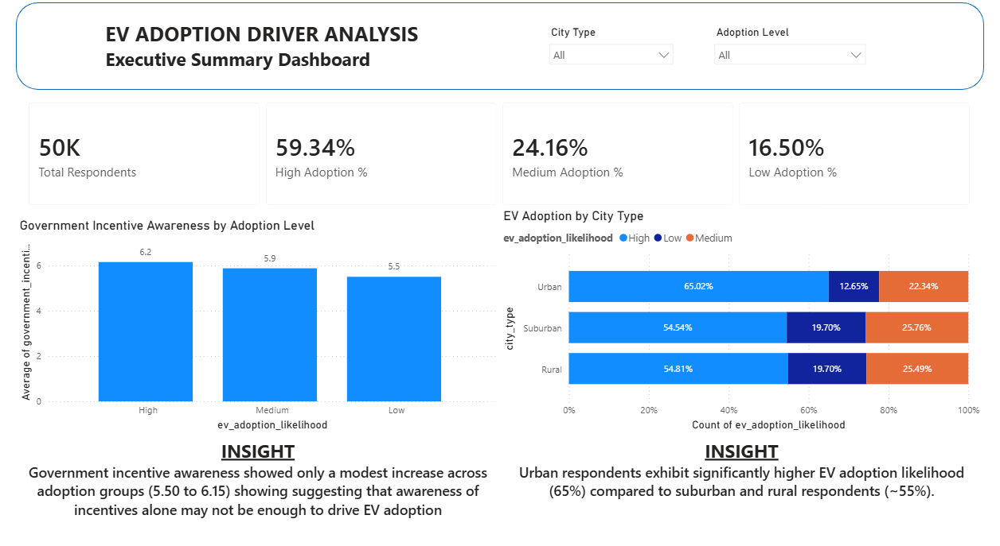
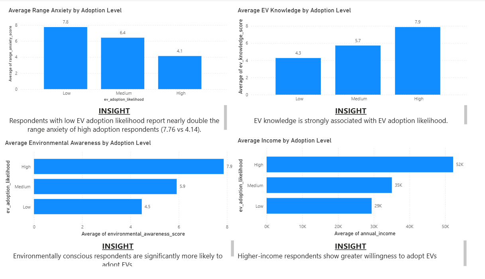
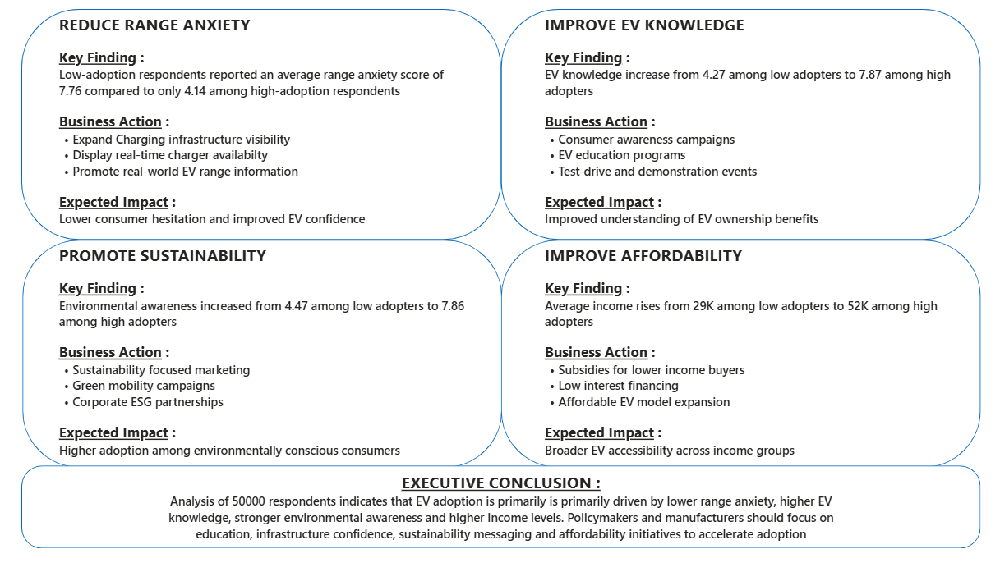

# EV Adoption Drivers Analysis

## Project Overview

This project analyzes factors influencing Electric Vehicle (EV) adoption using survey data from approximately 50,000 respondents.

The objective was to identify key drivers and barriers to EV adoption and provide actionable recommendations for policymakers and EV manufacturers.

---

## Business Problem

Despite growing interest in electric vehicles, adoption rates vary significantly across consumer groups.

**Key Question:** What factors most strongly influence EV adoption likelihood?

---

## Tools Used

- Excel (Data Cleaning & Preparation)
- SQL Server (Data Analysis)
- Power BI (Dashboard Development)

---

## Key Findings

- Contrary to expectation, government incentive awareness showed the weakest association with EV adoption compared to behavioral factors. EV      knowledge (4.27 → 7.87) and range anxiety (7.76 → 4.14) were far stronger predictors than policy awareness, suggesting education and            infrastructure confidence matter more than subsidy awareness.
- Range anxiety was one of the strongest barriers to EV adoption.
- EV knowledge strongly influenced adoption likelihood.
- Environmental awareness was highly correlated with adoption.
- Higher-income respondents were more likely to adopt EVs.
---

## Recommendations

- Increase awareness of government EV incentives through targeted campaigns.
- Reduce range anxiety through infrastructure visibility and consumer education.
- Improve EV awareness through educational initiatives and test-drive programs.
- Promote sustainability-focused messaging.
- Improve affordability through subsidies and financing options.

---

## Dashboard Pages

### Executive Summary

### Key Drivers of EV Adoption

### Recommendations & Business Actions

---

## Project Workflow

Excel → SQL Server → Power BI

Data Cleaning → Analysis → Insights → Recommendations

